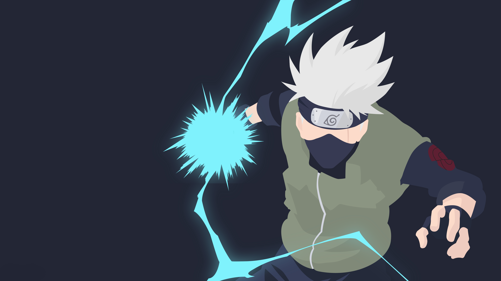
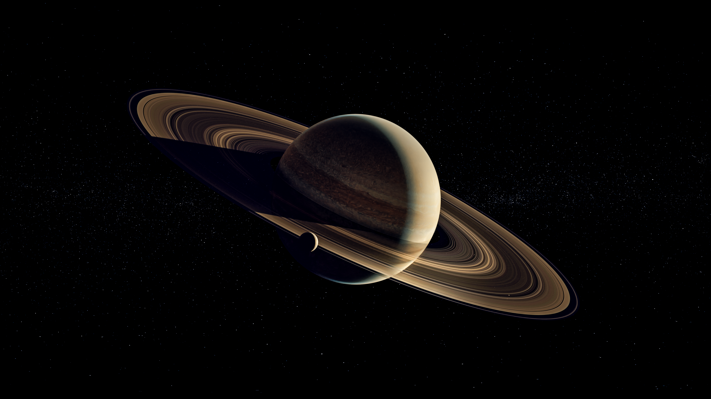
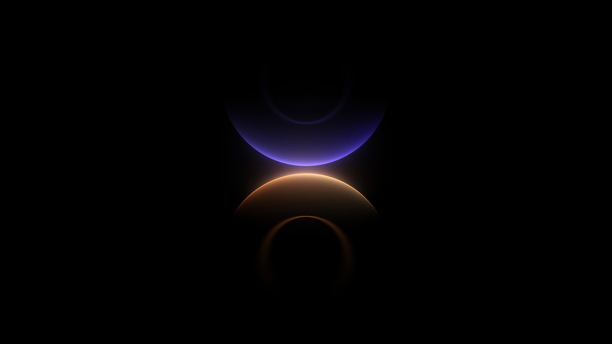
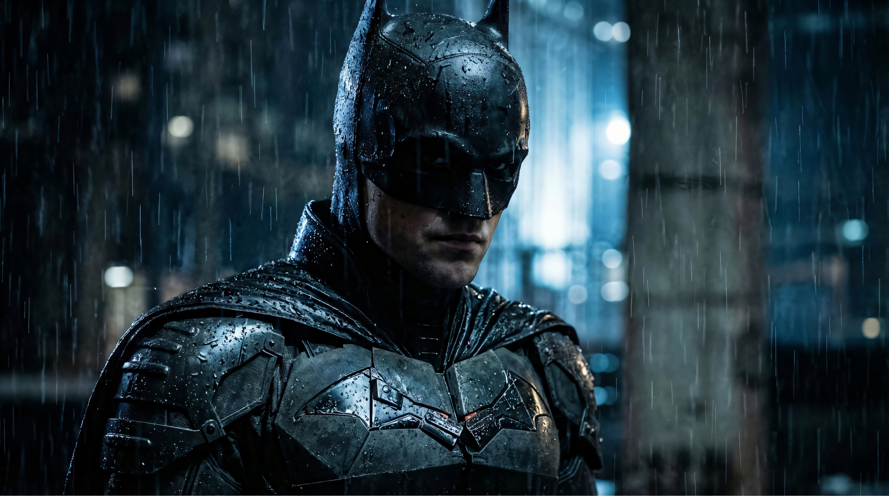
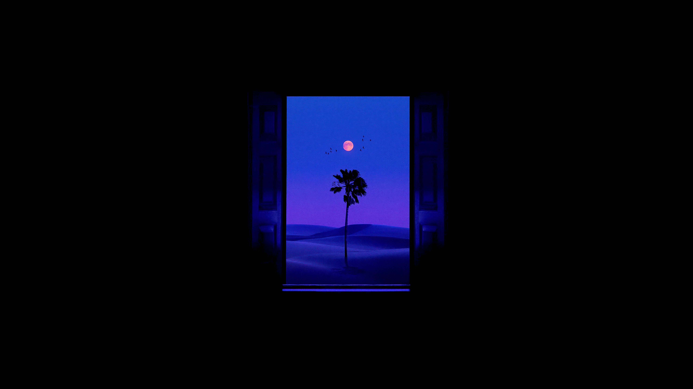

<div align="center">

# Santhoshhh Wallpapers
**A curated collection of 66 premium high-resolution wallpapers.**

[](https://santhoshhh.github.io/wallpapers/)
[](/)
[](/)

</div>

---

## The Collection
Welcome to my personal vault of carefully curated wallpapers spanning various aesthetics, resolutions (mostly 4K+), and styles. 

### Highlights

<div align="center">
  <table>
    <tr>
      <td width="33%"></td>
      <td width="33%"></td>
      <td width="33%"></td>
    </tr>
    <tr>
      <td width="33%"></td>
      <td width="33%"></td>
      <td width="33%"></td>
    </tr>
  </table>
</div>

*Note: The thumbnails above are just a tiny preview. To view the full collection, visit the [Live Masonry Gallery](https://santhoshhh.github.io/wallpapers/).*

---

## Organization Hierarchy

All 66 source images are neatly categorized in the `public/wallpapers/` folder:

- **Anime/** - Iconic characters across beloved series (e.g., Attack on Titan, My Hero Academia, Naruto).
- **Abstract_and_Aesthetic/** - Beautiful geometric prints, 3D renders, gradients, and soft glows.
- **Space_and_Nature/** - Breathtaking cosmic views, planets, horizons, and dramatic landscapes.
- **OS_Defaults/** - Classic and modern stock wallpapers from MacOS, Windows 11, Huawei, and Samsung. 
- **Pop_Culture/** - Legendary themes including Star Wars, Batman, Marvel, and more.

---

## Web Gallery Architecture
This repository is more than just a folder of images; it includes a **React 19 + Vite + Tailwind 4** frontend build:
- **Interactive UI**: A fully responsive Framer-Motion powered Masonry layout.
- **Dark Mode Focus**: A gorgeous `#050505` backdrop designed to make the images pop.
- **Auto-Manifesting**: Includes a custom CLI script that generates the `wallpapers.json` map instantly. 

### Running the UI Locally
```bash
# 1. Clone the repository
git clone https://github.com/santhoshhh/wallpapers.git

# 2. Install dependencies
npm install

# 3. Start the dev server
npm run dev
```

---

## How to Download
1. **Entire Collection**: Clone the repo or click `Code > Download ZIP`.
2. **Individual Wallpapers**: Navigate to `public/wallpapers/`, select the category and image you want. Click the **Download Raw File** button in GitHub (or view it natively in the web gallery to find direct download links).

<div align="center">
  <i>If you enjoy this collection, feel free to give the repository a star.</i>
</div>

---

## Disclaimer
**I do not own any of the wallpapers in this repository.** This is strictly a personal collection curated from various free sources across the internet. All rights, copyrights, and intellectual property belong to their respective original artists, creators, and platform publishers. 

If you are the original creator of any artwork provided here and would like it removed or properly credited, please open an issue and I will address it immediately.
